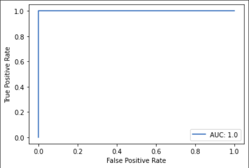
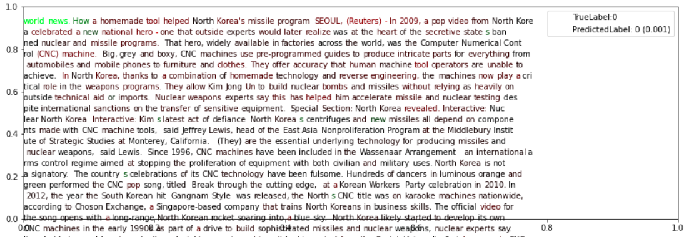
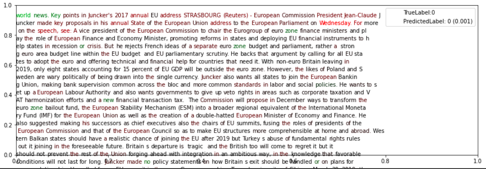

# Explainable-Fake-News-Detector
Our aim for this project is to:
* Integrate Explainable AI with a PreTrained Language Model trained on fake news. We implement this to analyse the incorrect samples being generated and provide insights to their occurence. 
* Also provide suggestions on how we can improve the model's performance and prevent the false positives.

Dataset Used: [Fake and Real News Dataset](https://www.kaggle.com/clmentbisaillon/fake-and-real-news-dataset)

Hugging Face Model: https://huggingface.co/SupritiVijay/fake-news-detector

## Results:

Our model achieves a very high accuracy on the dataset. Thus, we examine the slightly incorrect or unsure samples for inference.

### AUC Curve: 

### Interpretability Pipeline

* In order to examine whether the model is able to infer the context of the sentence and classify it accurately, we colorcode words based on significance to each of the output categories.

* We calculate this significance by replacing and deleting each word and measuring its importance to the sentence's output leaning towards a particular output category (Fake or Real).

### Demonstration of Unsure Example 1:

#### Inference:

1. The fact that, `US News` seems to be highlighted followed by `politics` below, we can infer that **SUBJECT** seems to be modifying results greatly, therefore a methodology which employs an embedding layer to input subjects would make it more learnable. 

  **Suggestion:** Would be to employ DistlBert to extract embedding_vec over the **title+text**, and **embedding_id-->embedding_vec**, concatenate the two, and a classification layer, which is able to learn using both vectors.

2. An interesting aspect is the impact of sources and organizations, both `CNC, Korea` and `Reuters` seem to be highlighted, which would mean that names seem to be an integral aspect of fake-true news detection. 

  **Suggestion:** Employing **Targetted attention through attention-masking**, would be an interesting aspect of understanding organization inference for classification by the model.

### Demonstration of Unsure Example 2:

#### Inference:

1. Now, here the true label is real news, we can see the model infers locational tags and particular names for potentially labelling it as Fake news. This would be due to a possible political bias within the data-distribution. 

	**Suggestion:** Another masking structure may be introduced for **data cleaning**!

2. **Suggestion:** Removal of proper nouns, and left-right political **bias mitigation**.